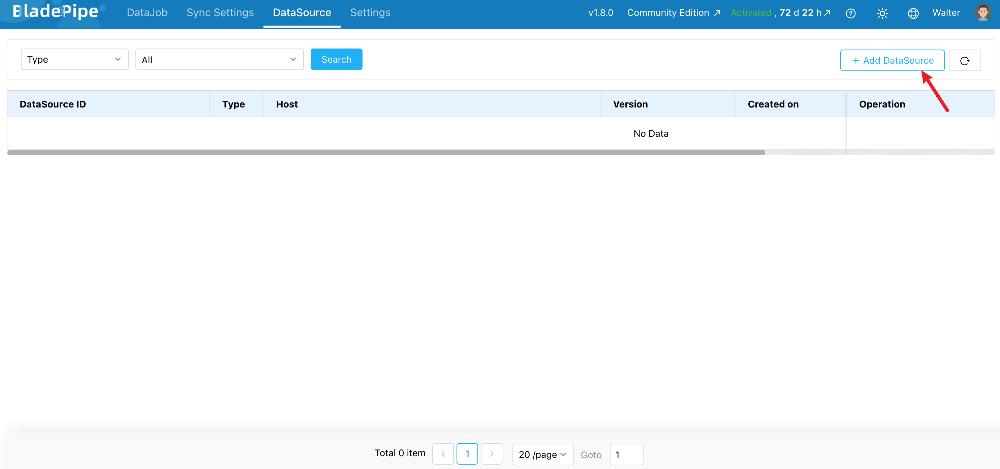
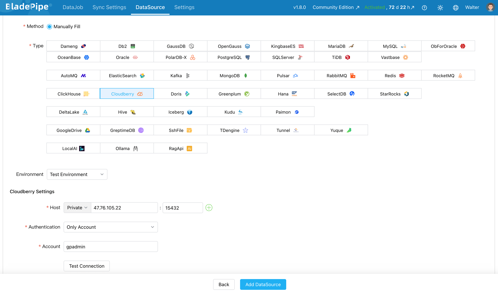
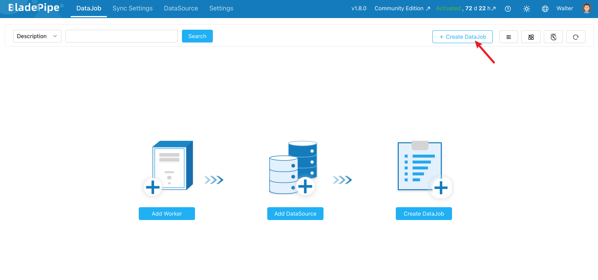
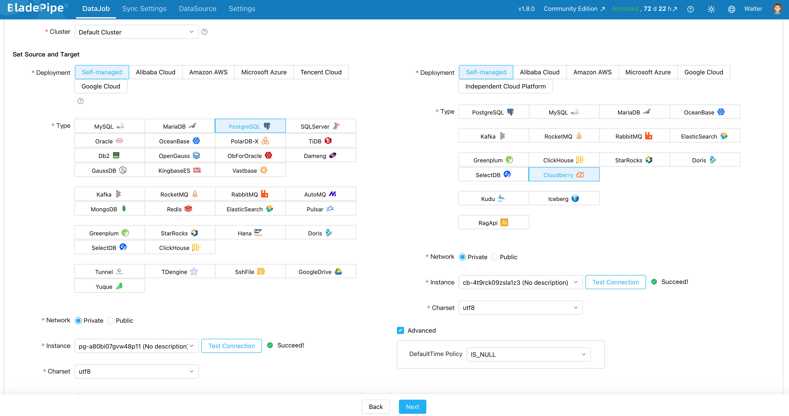
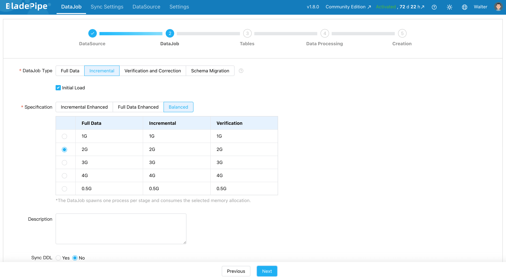
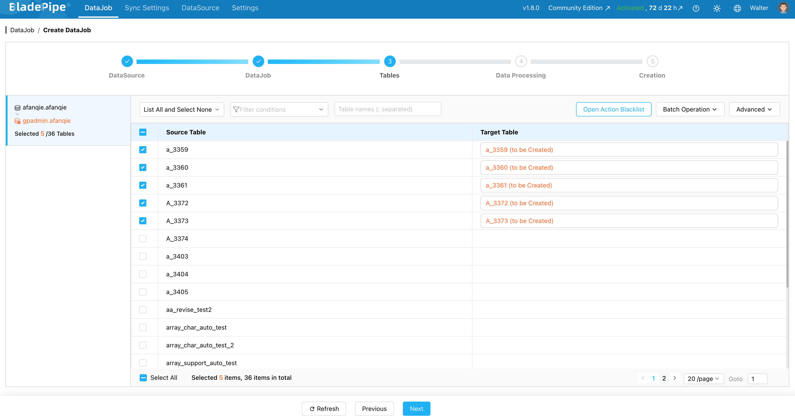
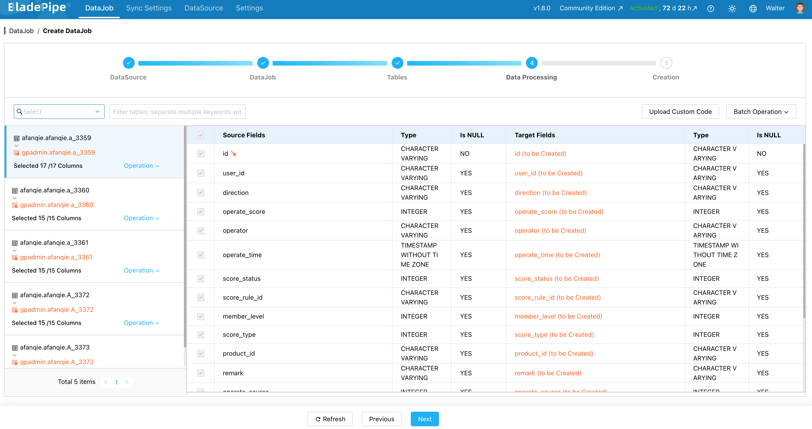
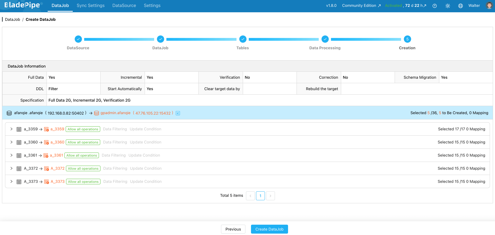
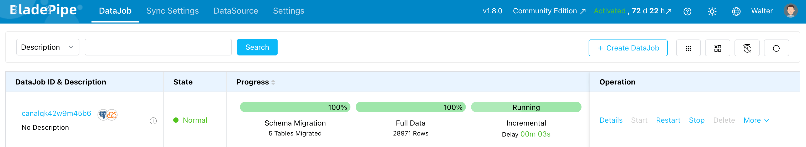

# BladePipe

[BladePipe](https://www.bladepipe.com/) is a real-time data integration and CDC platform. It helps you build data pipelines in a no-code way between different databases, data warehouses and data lakes, including Apache Cloudberry.

BladePipe supports data movement from PostgreSQL/Greenplum to Apache Cloudberry, including: 

- Schema migration.
- Full data migration.
- Incremental data synchronization.
- Data verification and correction.
- DDL synchronization for common schema changes.

This document will show how to synchronize data from PostgreSQL to Apache Cloudberry.

## Prerequisites

- Make sure the PostgreSQL account has the [required permissions](https://www.bladepipe.com/docs/dataMigrationAndSync/datasource_func/PostgreSQL/privs_for_pg/).
- Apache Cloudberry is deployed and running.
- [BladePipe (v1.6.0 or higher)](https://www.bladepipe.com/docs/productOP/onPremise/installation/install_all_in_one_docker/) is installed and accessible.

## Steps

### Step 1: Add DataSources

1. Log in to BladePipe. Go to **DataSource** > **Add DataSource**.

2. Add Apache Cloudberry and PostgreSQL separately as a DataSource:
   - **Deployment**: Select **Self-managed**.
   - **Type**: Select **Cloudberry** / **PostgreSQL**.
   - **Host**: Enter the database host and port.
   - **Account & Password**: Enter the username and password of Cloudberry / PostgreSQL.
  
3. Click **Test Connection**. Then click **Add DataSource**.

### Step 2: Create a DataJob

1. Go to **DataJob** > **Create DataJob**.

2. Select PostgreSQL as the source DataSource and Cloudberry as the target DataSource.

3. Choose the DataJob type. For synchronization tasks, select **Incremental** with **Initial Load**. The initial load migrates existing data. Incremental sync keeps Cloudberry updated after the initial load finishes.

4. Select which tables to sync. You can include everything or pick specific ones.

5. Select the columns to sync. Here you can process data, like filtering and transformation.

6. Click **Create DataJob** to start the DataJob.

7. You can check the pipeline status and progress on the DataJob page.
