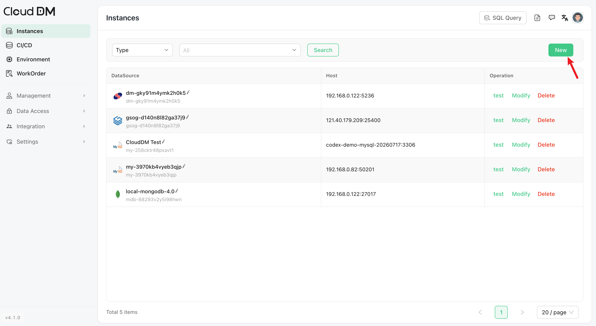
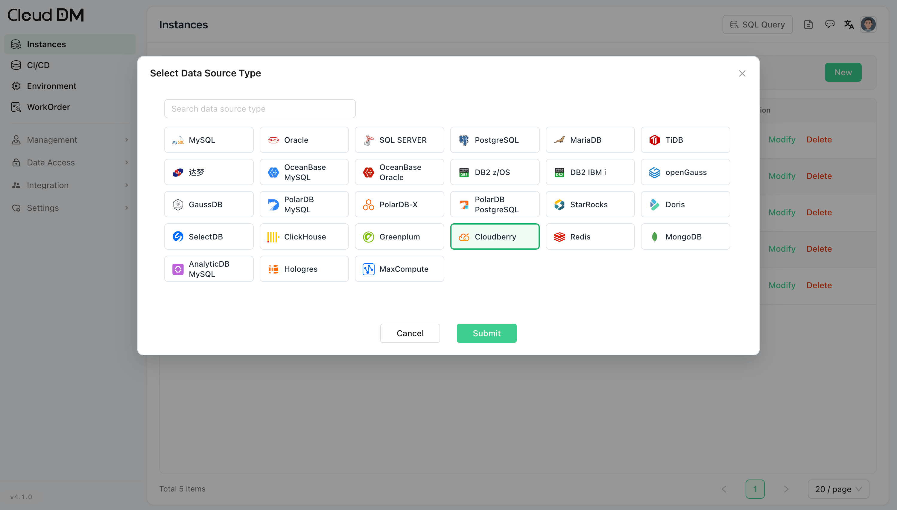
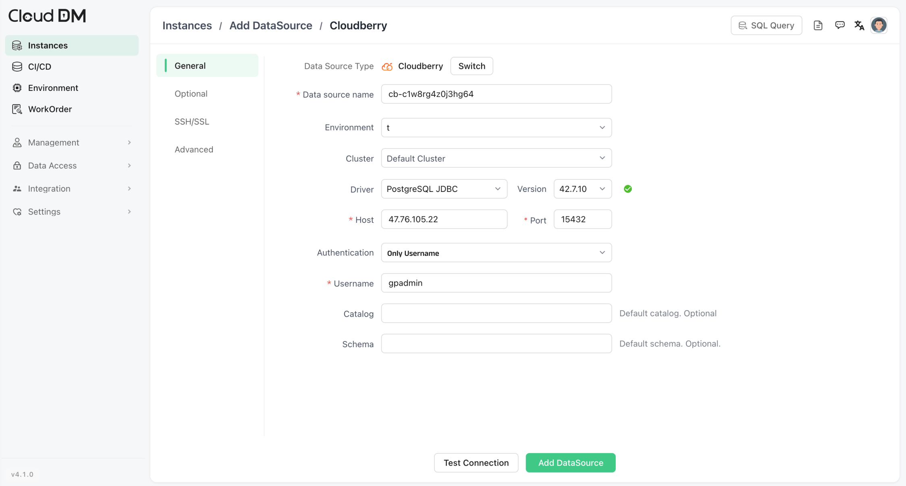
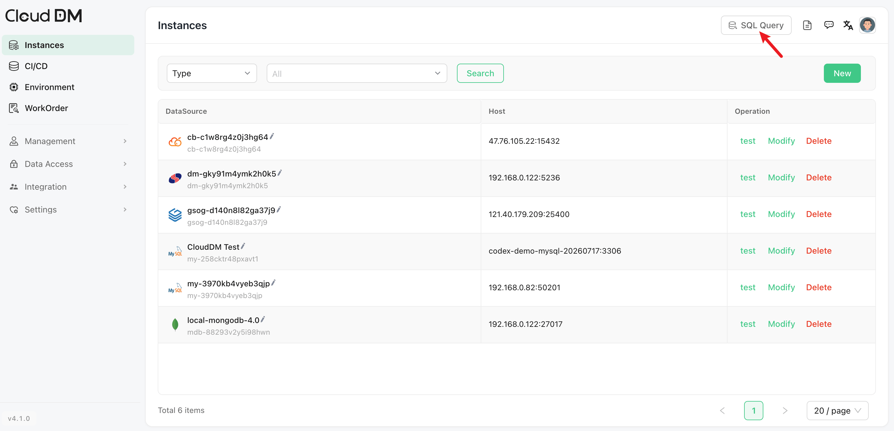
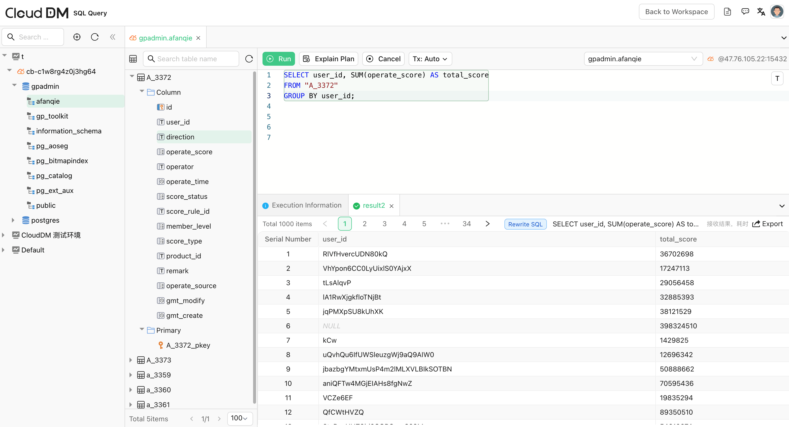
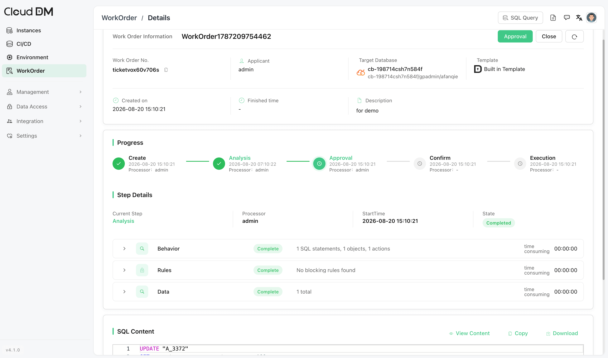
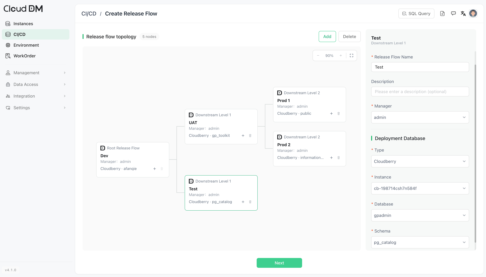
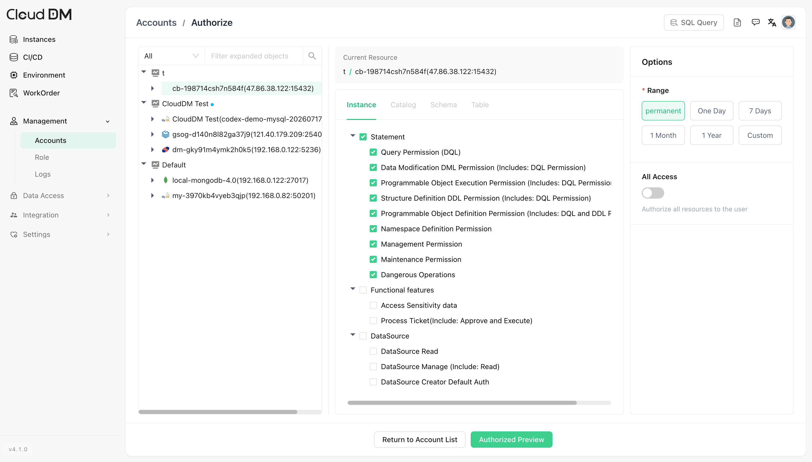

# CloudDM

CloudDM is an open-source database management tool for teams. It provides a web console for SQL queries, database management, access control, SQL auditing, approval workflows, and database CI/CD. It supports multiple databases, including MySQL, Oracle, StarRocks, and Apache Cloudberry.

This document shows how to connect CloudDM to Apache Cloudberry and run SQL queries.

## Prerequisites

- Apache Cloudberry is deployed and running.
- Database access permissions are properly configured in `pg_hba.conf`.
- [CloudDM (v4.1.0 or higher)](https://github.com/ClouGence/open-cdm) is installed and accessible.

## Steps

1. Log in to the CloudDM console, and click **Back to Workspace**.

2. In the left panel, click **Instances**, and then click **New** to add a database connection.

3. Select Cloudberry and click **Submit**.

4. Enter the Cloudberry connection information:
    - **Host**: Enter the hostname or IP address of your Cloudberry instance.
    - **Port**: Enter the port.
    - **Authentication**: Select an authentication method and enter the required information (for example, username and password)

    

5. Test the connection. Once Cloudberry is connected to CloudDM, click **Add DataSource**.

    If the test fails, check the Cloudberry address, port, database user, password, network access, and `pg_hba.conf` rules.

6. Go to **SQL Query**. 

7. The added Cloudberry instance is shown in the left panel. Now you can start running a query.

## Other features

### Work orders

CloudDM supports work orders for production database changes. Teams can submit, approve, and execute changes through a controlled workflow.

### CI/CD

CloudDM can trigger database CI/CD workflows through Git Push, Web Hook, and HttpCall. Teams can include SQL checks, approvals, and execution in application release processes, and manage database change scripts in one place.

### User access control

CloudDM supports role-based access control (RBAC) for team collaboration. Teams can grant access by role and control which data sources and operations each user can use.
